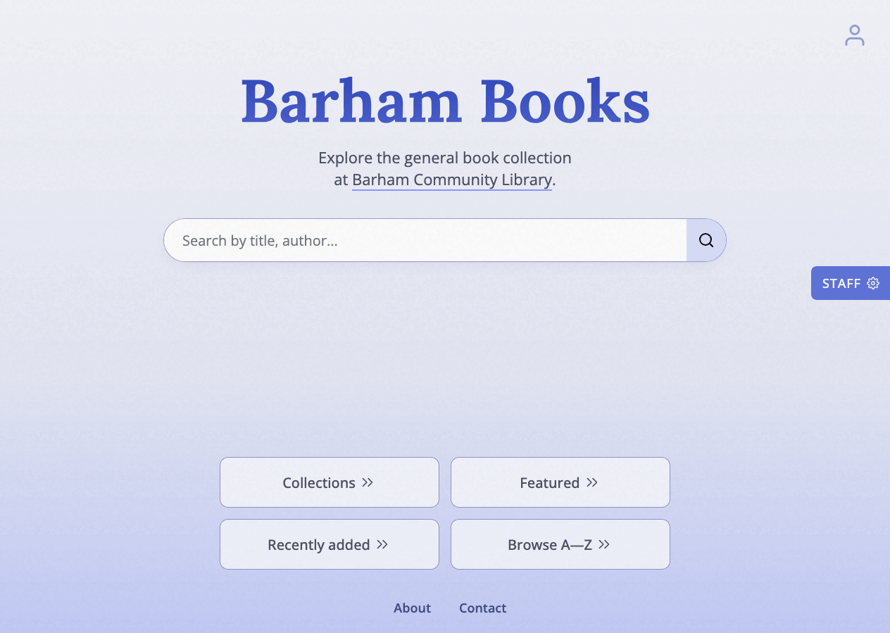

# Barham Books

   

    

## Description

A book catalogue web app built with Django that stores information about books, book series, and authors. The web app serves a local community library.

## Usage

The deployed web app can be accessed in a browser via the link below.

https://www.barhamlibrary.xyz/

Any user can search for books, view information about a book (including seeing related books), browse books by A-Z or through a curated collection, or contact staff users via a captcha contact form.

Users can also create an account where they can "like", review, or register an interest in books.

Staff accounts can add or update information about a book or author, and can deal with registered book interests.

## Features

Features include smart search autocomplete, a comprehensive book tagging system (which helps drive the curated collections and related books features), and a book-adding wizard for staff users that uses Google's Book API to help prepopulate fields.

## History

This app was originally built in mid-2020, where it had LMS features such as book reservations, records, etc., before being refactored and streamlined into more of a catalogue-based system in early 2026.

## Credits

The first two links helped a lot back when I originally built the app and didn't know anything about web development. The last link helped to motivate and inspire me to recently refactor the app most recently.

- [Python Django Dev To Deployment by Brad Traversy](https://www.udemy.com/course/python-django-dev-to-deployment/?couponCode=KEEPLEARNING)
- [Django 3 By Example by Antonio Melé](https://www.packtpub.com/en-us/product/django-3-by-example-9781838989323)
- [Build a Responsive Website by Jessica Chan](https://coder-coder.teachable.com/p/brw-ultimate-course)
